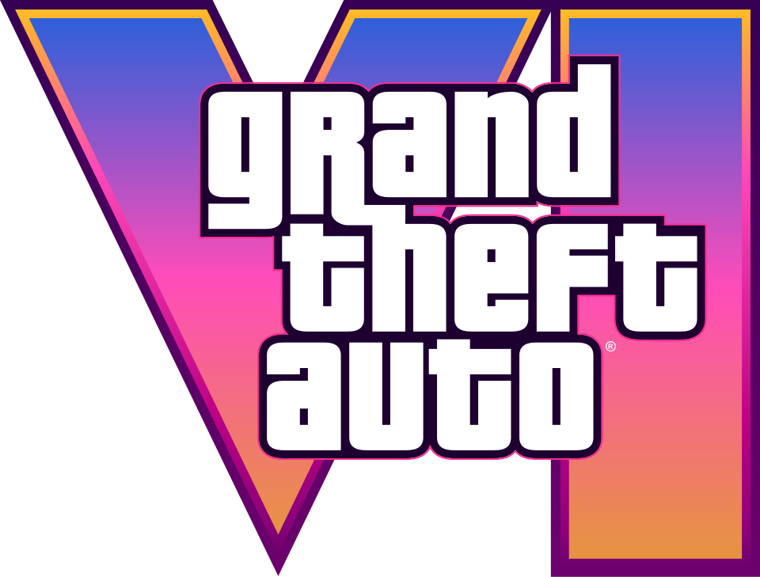

#  gta-vi-landing-experience


Una landing page interactiva y de alto rendimiento que actúa como tributo a **Grand Theft Auto VI**, desarrollada usando **Astro 5**, **Tailwind CSS v4** y **GSAP (ScrollTrigger)**. El sitio traslada la vibrante atmósfera costera y de luces de neón del estado de Leonida y Vice City directamente al navegador.

Este proyecto destaca por su arquitectura limpia y modular, animaciones fluidas al hacer scroll y elementos altamente interactivos para el usuario.

---

## Origen del Proyecto e Inspiración

El concepto inicial del efecto de máscara de scroll de este proyecto y su diseño base están inspirados en el videotutorial del creador y desarrollador de software **midudev**:
🎥 **[Cómo recrear la web de GTA 6 - Tutorial de midudev](https://www.youtube.com/watch?v=YAgkFlyw_i0)**

A partir de este concepto original enfocado en la máscara de zoom cinemática, expandimos y profesionalizamos la plataforma añadiendo múltiples secciones interactivas, modularizando la arquitectura en componentes aislados y puliendo la estética visual a nivel de una producción comercial.
---

## Tecnologías y Arquitectura

### Stack Tecnológico
*   **[Astro 5](https://astro.build/)** — El framework preferido para sitios web enfocados en contenido rápido. Genera HTML estático ultraligero con hidratación mínima de JavaScript.
*   **[Tailwind CSS v4 (Vite Plugin)](https://tailwindcss.com/)** — Utilizado para una maquetación responsiva moderna, control de colores HSL fluidos, temas neón y transiciones optimizadas por GPU.
*   **[GSAP & ScrollTrigger](https://gsap.com/)** — Para modelar la línea de tiempo cinemática y la animación de cascada (stagger) de los componentes al hacer scroll.
*   **[TypeScript](https://www.typescriptlang.org/)** — Controla la lógica interactiva del reproductor de música y las simulaciones de la red social de forma robusta.

### Modos de Construcción y Renderizado
*   **Modo de Renderizado Estático (Static Build):** El proyecto está configurado para compilarse en modo puramente estático (`output: "static"`). Esto significa que se genera en un conjunto de archivos HTML, CSS y JS optimizados, ideales para ser alojados de forma gratuita y con máxima velocidad en plataformas como **GitHub Pages**, Vercel, Netlify o Cloudflare Pages.
*   **Modelo de Componentes Astro:** Estructura modular dividida en componentes reutilizables (`.astro`) que separan la lógica de estilos e interactividad del script principal de la página.

---

## Estructura del Proyecto

```
gta-vi-landing-experience/
│
├── public/                        # Archivos estáticos públicos
│   ├── fonts/                     # Fuentes personalizadas
│   ├── favicon.svg
│   ├── logo.svg.png               # Logo principal del proyecto
│   ├── logo-stack.svg
│   └── preview.jpg                # Preview del README
│
├── src/
│   ├── assets/                    # Imágenes y recursos internos
│   │   ├── full-logo.webp
│   │   ├── hero-key-background.webp
│   │   ├── hero-key-logo.webp
│   │   ├── jason-portrait.png
│   │   ├── lucia-portrait.png
│   │   ├── vice-city-night.png
│   │   ├── vice-city-scenery.png
│   │   ├── logo-cutted.svg
│   │   ├── logo-vi.svg
│   │   ├── keep-scrolling.svg
│   │   ├── play-button.svg
│   │   ├── ps5.svg
│   │   └── xbox.svg
│   │
│   ├── components/                # Componentes reutilizables (.astro)
│   │   ├── Countdown.astro        # Contador de lanzamiento
│   │   ├── FAQ.astro              # Preguntas frecuentes
│   │   ├── Features.astro         # Características del juego
│   │   ├── Footer.astro           # Pie de página
│   │   ├── Gallery.astro          # Galería Lightbox
│   │   ├── HeroMask.astro         # Intro de máscara cinemática
│   │   ├── Leonida.astro          # Sección El Estado de Leonida
│   │   ├── Navbar.astro           # Barra de navegación
│   │   ├── Protagonists.astro     # Perfil de los personajes
│   │   ├── RadioPlayer.astro      # Reproductor de radio interactivo
│   │   ├── SocialFeed.astro       # Simulación de red social (LifeInvader)
│   │   ├── StoreEditions.astro    # Ediciones de compra
│   │   └── TrailerModal.astro     # Reproductor de tráiler modal
│   │
│   ├── layouts/                   # Diseños base de la página
│   │   └── Layout.astro           # Layout principal del sitio
│   │
│   ├── pages/                     # Páginas de la aplicación (Enrutado)
│   │   └── index.astro            # Página de inicio (Landing Page)
│   │
│   └── styles/                    # Archivos de estilos CSS
│       └── global.css             # Estilos globales
│
└── package.json                   # Configuración y dependencias del proyecto
```

---

## 🚀 Guía de Instalación Rápida (Cómo levantarlo en tu PC)

Para ejecutar este proyecto de forma local en tu computadora, sigue estos pasos:

1. **Requisitos Previos**: Asegúrate de tener instalado [Node.js](https://nodejs.org/) (versión 18 o superior).
2. **Clona el Repositorio** (o haz un Fork primero y clona tu copia):
   ```bash
   git clone https://github.com/ByChokeYT/gta-vi-landing-experience.git
   ```
3. **Instala las Dependencias**:
   ```bash
   cd gta-vi-landing-experience
   npm install
   ```
4. **Inicia el Servidor de Desarrollo**:
   ```bash
   npm run dev
   ```
   Abre [http://localhost:4321](http://localhost:4321) en tu navegador para ver la experiencia en tiempo real.

5. **Compila para Producción** (Genera la carpeta `/dist` estática lista para subir a GitHub Pages, Vercel, Netlify, etc.):
   ```bash
   npm run build
   ```

---

## 🤝 ¡Colabora en este Proyecto! (Para mis Seguidores)

¡Este proyecto está hecho por y para la comunidad de seguidores! Si quieres aprender desarrollo web, aportar una mejora o añadir un detalle divertido, ¡esta es tu oportunidad!

### 💡 ¿Cómo puedes colaborar?
*   **Easter Eggs**: Añadir secretos en el mapa, interacciones al hacer clic en ciertos elementos o referencias divertidas al tráiler.
*   **Música y Radio**: Incorporar más emisoras clásicas o canciones icónicas del universo de GTA.
*   **Mejoras Visuales**: Proponer más animaciones con GSAP o mejorar la respuesta responsive en móviles antiguos.
*   **Contenido**: Traducir secciones, redactar nuevas preguntas frecuentes (FAQ) o expandir información de los personajes.

### 🛠️ Pasos para Enviar tu Mejora (Pull Request)
1. Haz un **Fork** de este repositorio pulsando el botón de arriba a la derecha.
2. Clona tu Fork localmente y crea una rama para tu mejora:
   ```bash
   git checkout -b feature/mi-mejora-increible
   ```
3. Realiza tus cambios en el código y pruébalos con `npm run dev`.
4. Guarda y sube tus cambios:
   ```bash
   git add .
   git commit -m "Añade: [breve explicación de tu aporte]"
   git push origin feature/mi-mejora-increible
   ```
5. Ve a tu repositorio en GitHub y abre un **Pull Request (PR)** hacia la rama principal de este repositorio.

¡Yo revisaré y aceptaré vuestras propuestas para agregarlas a la web oficial! Todos los colaboradores aparecerán listados automáticamente en la sección de contribuyentes de GitHub. ¡Hagamos la mejor landing de GTA VI juntos! 🚀

---

## ⚖️ Créditos y Derechos de Autor

Este proyecto ha sido desarrollado únicamente para fines educativos, de portafolio y aprendizaje técnico. Todos los materiales de audio, imágenes de marca, nombres y logotipos mostrados pertenecen a **Rockstar Games** y **Take-Two Interactive**.
